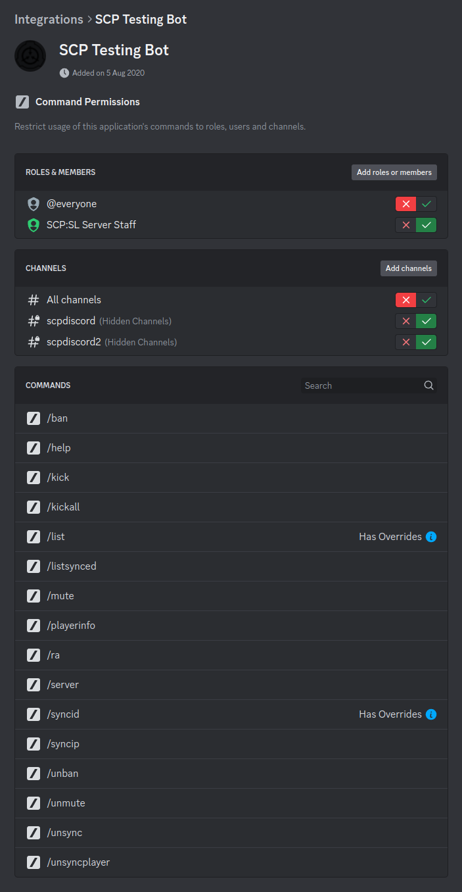

# Bot Setup

## 1. Download the bot

Download the SCPDiscord bot application, either a [release](https://github.com/KarlOfDuty/SCPDiscord/releases) or [dev build](https://jenkins.karlofduty.com/blue/organizations/jenkins/CI%2FSCPDiscord/activity/).

There are two versions available:
- The self-contained version which can run on its own.
- A smaller version which requires you to install .NET 8.0 on the system first.

Pick the one you want and extract it somewhere where your user has permission to read and write.

## 2. Run the bot

Open a terminal in the directory where you placed the bot and run it:
```bash
# Use the file name of the version you downloaded
./SCPDiscordBot
```

This should now have generated the default config in the current directory.

If you want to run several bots you can just enter the config you want to use for each instance as a command parameter:
```bash
./SCPDiscordBot --config config1.yml
./SCPDiscordBot --config config2.yml
```

If you are unable to run the bot make sure the file has correct permissions.

## 3. Configure the bot

[Click here to view default config](https://github.com/KarlOfDuty/SCPDiscord/blob/master/SCPDiscordBot/default_config.yml)

The different options are described in the config. Get Discord IDs by turning on developer mode in Discord and right clicking on a server, role or user.

Restart the bot to apply the changes.

> [!NOTE]
> Remember to set the bot port to something **different from the scpsl server port**, or everything will break.

> [!NOTE]
> Remember this port as you will need to put it in the plugin config too.

## 4. Set bot command permissions

Make sure to restrict who is allowed to use the bot's commands in your Discord server settings:



> [!IMPORTANT]
> You can set more specific permissions for `/server` and `/ra` in the bot config.

> [!IMPORTANT]
> If your server uses Steam you should turn off the `/syncip` command and if not you should turn off the `/syncid` command.

> [!TIP]
> If you have several servers it is recommended that you limit command permissions for each bot to the channel they post in.
> This way your mods will not have to think about which bot they are executing the command on, they will automatically get the correct one from the channel they are typing in.
> (This does not work for the server owner as they will always have permission to use all commands everywhere)

