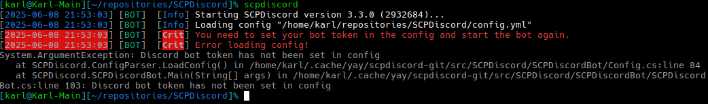
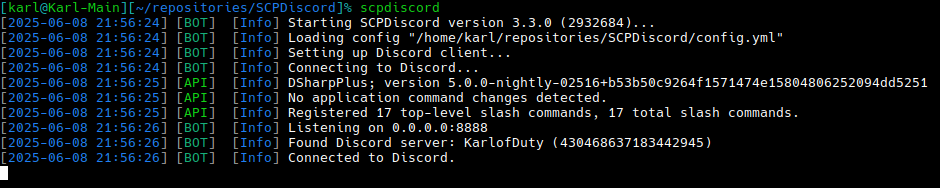
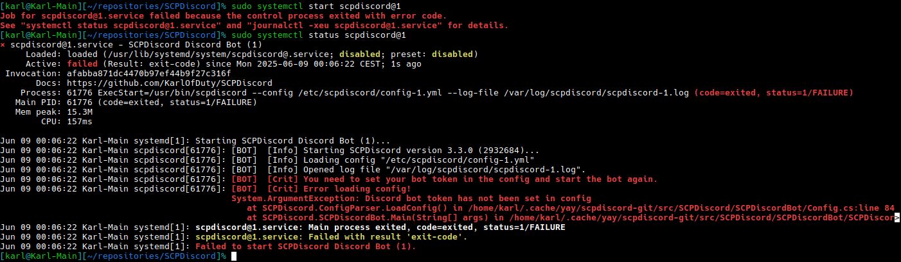
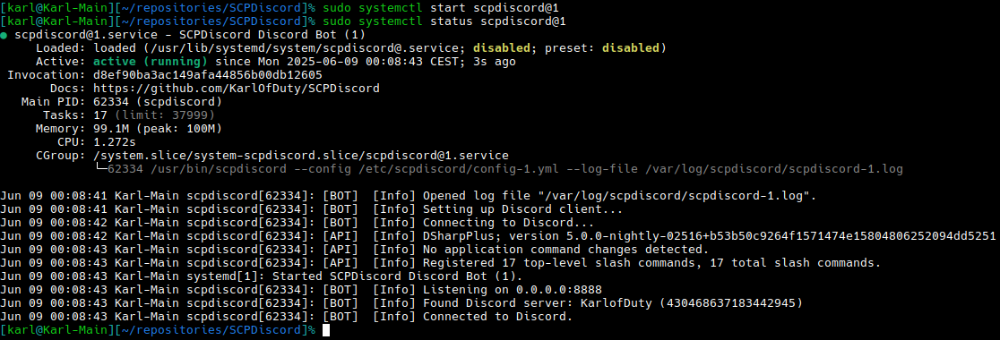

# 1. Installing the Bot

The bot is tested on the following operating systems:
- Arch
- Debian 12
- Fedora 42
- RHEL 9
- RHEL 10
- Ubuntu 24.04
- Windows 10

> [!NOTE]
> The bot should work on other versions of the above systems and other distributions based on them.
> However, you must use an x64 architecture operating system. Arm systems such as the Raspberry Pi are not supported at this time.
>
> Please open an issue or contact me in Discord immediately if any of the packages don't work properly on a specific distribution.

### Installation Instructions

<details>
<summary><b>Ubuntu-based (Ubuntu, Pop!_OS, Mint, Zorin, etc)</b></summary>
<br/>

SCPDiscord is available in the repository at repo.karlofduty.com.

**1.** Install the dotnet repository (Only needed for Ubuntu 24.04 and older):
```bash
sudo add-apt-repository ppa:dotnet/backports
sudo apt update
```

**2.** Install the repo.karlofduty.com repository:
```bash
wget https://repo.karlofduty.com/ubuntu/dists/ubuntu/karlofduty-repo_latest_amd64.deb
sudo apt install ./karlofduty-repo_latest_amd64.deb
sudo apt update
```

**3.** Install the release or dev build:
```bash
sudo apt install scpdiscord
# or
sudo apt install scpdiscord-dev
```

</details>

<details>
<summary><b>Other Debian-based (Debian, Kali, Deepin, etc)</b></summary>
<br/>

SCPDiscord is available in the repository at repo.karlofduty.com.

**1.** Install the dotnet repository:  
The url used in the `wget` command is for Debian 12, if you are using a different version, replace `12` with the version you are using.
See this link for a list of all available versions: https://packages.microsoft.com/config/.
```bash
wget https://packages.microsoft.com/config/debian/12/packages-microsoft-prod.deb -O packages-microsoft-prod.deb
sudo dpkg -i packages-microsoft-prod.deb
rm packages-microsoft-prod.deb
```

**2.** Install the repo.karlofduty.com repository:
```bash
wget https://repo.karlofduty.com/debian/dists/debian/karlofduty-repo_latest_amd64.deb
sudo apt install ./karlofduty-repo_latest_amd64.deb
sudo apt update
```

**3.** Install the release or dev build:
```bash
sudo apt install scpdiscord
# or
sudo apt install scpdiscord-dev
```

</details>

<details>
<summary><b>RHEL-based (RHEL, Alma, Rocky, etc)</b></summary>
<br/>

SCPDiscord is available in the repository at repo.karlofduty.com.

1. Install the repo.karlofduty.com repository:
```bash
sudo dnf install https://repo.karlofduty.com/rhel/karlofduty-repo-latest.x86_64.rpm
```

2. Install the release or dev build:
```bash
sudo dnf install scpdiscord --refresh
# or
sudo dnf install scpdiscord-dev --refresh
```

</details>

<details>
<summary><b>Other Fedora-based (Fedora, Nobara, Bazzite, etc)</b></summary>
<br/>

SCPDiscord is available in the repository at repo.karlofduty.com.

1. Install the repo.karlofduty.com repository:
```bash
sudo dnf install https://repo.karlofduty.com/fedora/karlofduty-repo-latest.x86_64.rpm
```

2. Install the release or dev build:
```bash
sudo dnf install scpdiscord --refresh
# or
sudo dnf install scpdiscord-dev --refresh
```

</details>

<details>
<summary><b>Arch-based (Arch, Manjaro, EndeavourOS, SteamOS, etc)</b></summary>
<br/>

SCPDiscord is available in the Arch User Repository as [scpdiscord](https://aur.archlinux.org/packages/scpdiscord/) and [scpdiscord-git](https://aur.archlinux.org/packages/scpdiscord-git/).
This example uses yay, but you can use any package manager with AUR support.

- Install the release or dev build:
```bash
yay -S scpdiscord
# or
yay -S scpdiscord-git
```

You may see a warning about verifying workloads during installation, this can be ignored.

</details>
<br/><br/>

> [!WARNING]
> It is highly recommended to install the bot using the package managers listed above if possible.
> When manually installing you will not get additional features such as automatic updates, manual entries, system services, etc.

<details>
<summary><b>Manual Download (Windows / Other Linux)</b></summary>
<br/>

You can download the bot manually by downloading the binary directly from the github release or jenkins build:

**1.** (Optional) Install .NET 9 if it isn't already installed on your system.

**2.** Download the bot for your operating system, either a [release version](https://github.com/KarlOfDuty/SCPDiscord/releases) or a [dev build](https://jenkins.karlofduty.com/blue/organizations/jenkins/SCPDiscord/activity).
While the Windows versions are fully supported they are not as well tested as the Linux ones.

| Application         | Description                                                         |
|---------------------|---------------------------------------------------------------------|
| `scpdiscord`        | Standard Linux version.                                             |
| `scpdiscord-sc`     | Larger Linux version which does not require .NET to be installed.   |
| `scpdiscord.exe`    | Standard Windows version.                                           |
| `scpdiscord-sc.exe` | Larger Windows version which does not require .NET to be installed. |

</details>

# 2. Running the Bot for the First Time

> [!TIP]
> If you want a very simple setup with its files placed in the current working directory and the bot running in your terminal, choose the basic setup.
>
> If you want to run the bot in the background as a system service that automatically starts up when the system is restarted and runs as its own user for security, choose the system service setup.

<details>
<summary><b>Basic Setup</b></summary>
<br/>

**1.** Run the bot to generate the config file:



**2.** A config file will have been generated in the current working directory. Open it in a text editor of your choice and set it up to your liking. It contains instructions for all options.

**3.** Run the bot again and it should start without issue:



If you want to run several bots you can just enter the config you want to use for each instance as a command parameter:
```bash
scpdiscord --config config-1.yml
scpdiscord --config config-2.yml
```

</details>

<details>
<summary><b>System Service Setup</b></summary>
<br/>

**1.** Run the bot to generate a config file:
```bash
sudo systemctl start scpdiscord@1
systemctl status scpdiscord@1
```


**2.** Open the bot config at `/etc/scpdiscord/config-1.yml` using your preferred text editor and set it up to your liking. It contains instructions for all options.

**3.** Starting the bot service and check its status:
```bash
sudo systemctl start scpdiscord@1
systemctl status scpdiscord@1
```


**4.** (Optional) Make the service start automatically on boot:
```bash
sudo systemctl enable scpdiscord@1
```

Showing the full service log:
```bash
journalctl -u scpdiscord@1
```

Showing the live updating log:
```bash
journalctl -fu scpdiscord@1
```

If you want to run several bots you can just start more instances using different IDs:
```bash
sudo systemctl start scpdiscord@2
sudo systemctl start scpdiscord@3
sudo systemctl start scpdiscord@4
```

</details>

> [!NOTE]
> Remember to set the bot port to something **different from the scpsl server port**, or everything will break.

> [!NOTE]
> Remember this port as you will need to put it in the plugin config too.

# 3. Set bot command permissions

Make sure to restrict who is allowed to use the bot's commands in your Discord server settings:


> [!IMPORTANT]
> You can set more specific permissions for `/server` and `/ra` in the bot config.

> [!IMPORTANT]
> If your server uses Steam you should turn off the `/syncip` command and if not you should turn off the `/syncid` command.

> [!TIP]
> If you have several servers it is recommended that you limit command permissions for each bot to the channel they post in.
> This way your mods will not have to think about which bot they are executing the command on, they will automatically get the correct one from the channel they are typing in.
> (This does not work for the server owner as they will always have permission to use all commands everywhere)

